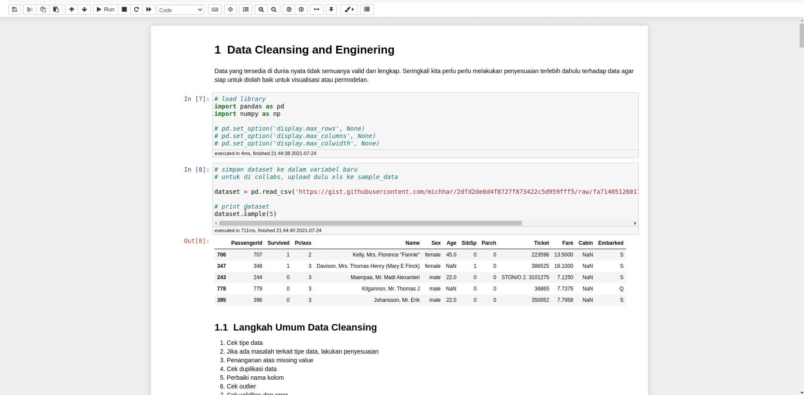

# Pin Cell Extension
---

Jupyter NB Extension to pin your important cell in the sidebar. Save your precious time scrolling up and down just for looking another cell.

## Install Extension

You need to clone this repo manualy
```git clone git://github.com/maziyank/pin_cell_extension```

and then copy folder `pin_cell` to your `(jupyter --data-dir)/nbextensions` folder in your machine,

After that, install this extension using this command:

``` jupyter nbextension install pin_cell ```

## Enable Extension
``` jupyter nbextension enable pin_cell/main ```

## Usage
- Select a cell that you want to pinned.
- Click pin cell icon in the toolbar



